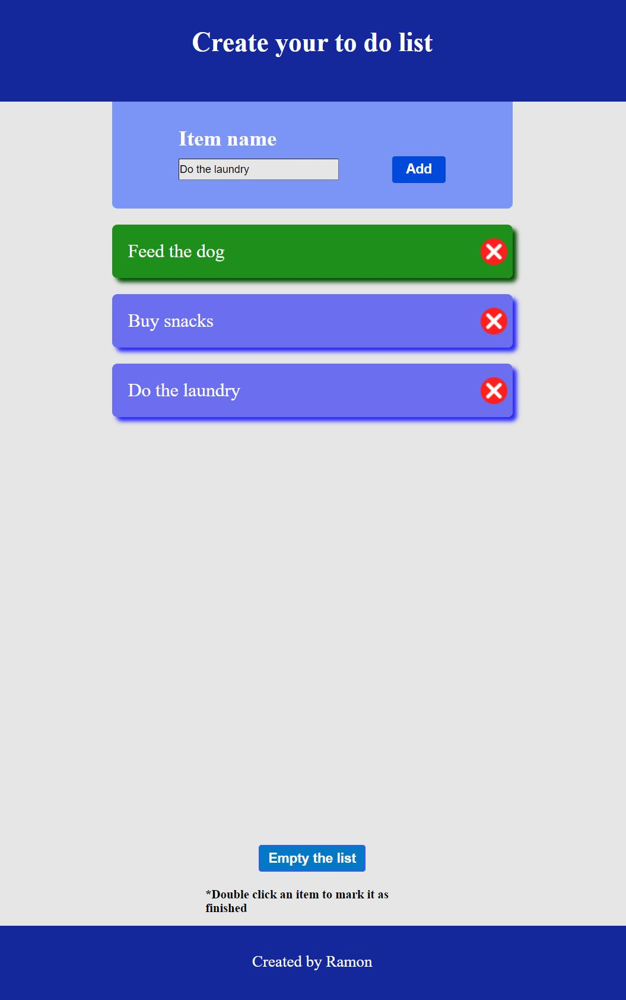

# JavaScriptToDo

## English:

One simple "to do" App with vanilla Java Script made entirely by myself not following any tutorials.

You can:

- Create task
- Delete task
- Mark a task as completed by double clicking it
- Clean entire list of tasks
- Warnings for repeated task 
- Warning when the user tries to add empty task

## Português:

Um aplicativo simples de "Lista de tarefas" com vanilla Java Script feito inteiramente por mim sem seguir nenhum tutorial.

Você pode:

- Criar tarefa
- Excluir tarefa
- Marcar uma tarefa como concluída clicando duas vezes nela
- Limpar toda a lista de tarefas
- Avisos para tarefas repetidas
- Aviso quando o usuário tenta adicionar tarefa vazia

